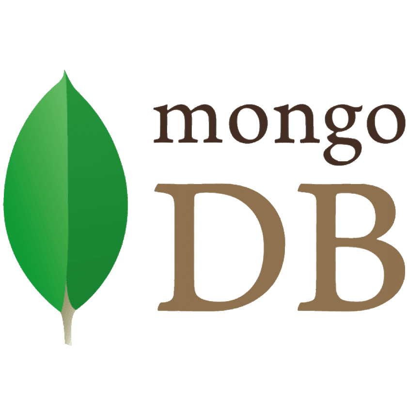

<div align="center">
  <a href="https://www.mongodb.com/"></a>
</div>

<div align="center">

# nonebot-plugin-mongodb

_✨ 基于 MongoDB ODM 的数据库管理插件 ✨_

<a href="./LICENSE">
    
</a>

<a href="https://pypi.python.org/pypi/nonebot-plugin-mongodb">
  
</a>

<a href="https://pypi.python.org/pypi/nonebot-plugin-mongodb">
    
</a>


<a href="https://pdm.fming.dev">
    
</a>

<a href="https://github.com/psf/black">
    
</a>

<a href="https://jq.qq.com/?_wv=1027&k=5OFifDh">
  
</a>
<a href="https://jq.qq.com/?_wv=1027&k=7LWx6q4J">
  
</a>

</div>

## 💿 安装

> 如果你不是插件开发者，那么此插件一般不需要额外安装和加载

<details>
<summary>pip</summary>

    pip install nonebot-plugin-mongodb

</details>
<details>
<summary>pdm</summary>

    pdm add nonebot-plugin-mongodb

</details>
<details>
<summary>poetry</summary>

    poetry add nonebot-plugin-mongodb

</details>
<details>
<summary>conda</summary>

    conda install nonebot-plugin-mongodb

</details>

在你的插件中添加对应的 require 以确保此插件在被引用前正确加载

```
from nonebot import require

require("nonebot_plugin_mongodb")
```

## ⚙️ 配置

在 nonebot2 项目的`.env`文件中添加下表中的配置, 配置均为**非必须项**

### 通用配置项

|       配置项        | 必填 | 类型 |  默认值  |        说明        |
| :-----------------: | :--: | :--: | :------: | :----------------: |
|      mongo_uri      |  ⭕  | str  |   None   | MongoDB 的连接 uri |
| mongo_database_name |  ❌  | str  | nonebot2 |   连接的数据库名   |

## 🎉 使用

> 如果你不是插件开发者，那么此部分无需阅读

> 参考 exmple 中的[示例代码](./example/beanie_usage.py)

在 nonebot 的 `startup` 阶段时，本插件会读取 `beanie.Document` 的全部子类并加载，因此开发者无需额外进行 `init_beanie` 即可直接使用，关于具体的操作方法可以参考 [beanie 文档](https://beanie-odm.dev/)。

## 🙏 感谢

在此感谢以下开发者(项目)对本项目做出的贡献：

- [nonebot-plugin-template](https://github.com/A-kirami/nonebot-plugin-template): 项目的 README 模板

## ⏳ Star 趋势

[](https://starchart.cc/Well2333/nonebot-plugin-mongodb)
